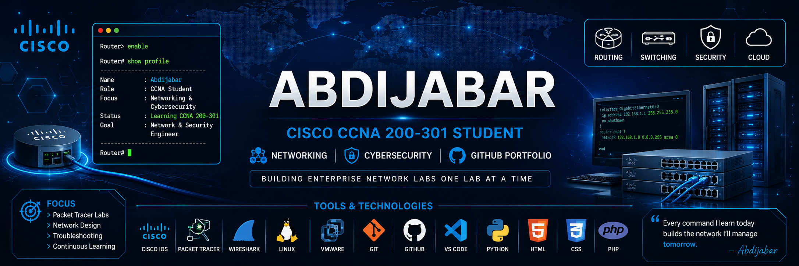

# Hi there 👋, I'm Abdijabar

🎓 Computer Science Student | 🌐 Networking & Cybersecurity Enthusiast

Welcome to my GitHub profile! I am passionate about building my skills in **networking, cybersecurity, and IT infrastructure**.

---

## 👨‍💻 About Me

- 🎓 Studying Computer Science (Networking & Cybersecurity)
- 🌱 Currently learning **Cisco CCNA Routing & Switching**
- 🔐 Interested in Network Security and Cybersecurity
- 🖥️ Building hands-on labs using Cisco Packet Tracer
- 📚 Always improving my technical skills

---

## 🛠️ Skills & Technologies

### Networking
- Cisco Packet Tracer
- Routing & Switching
- VLANs
- NAT
- DHCP
- STP
- Network Troubleshooting

### Cybersecurity
- Network Security Fundamentals
- Cryptography Basics
- Hashing & Encryption
- Security Tools

### Tools
- Wireshark
- VMware
- GNS3
- Git & GitHub

---

## 🚀 Projects

### 🌐 CCNA Labs
Hands-on Cisco networking labs including:
- Network Topologies
- Router & Switch Configurations
- VLAN Implementation
- Routing Protocol Practice

### 🔐 Cybersecurity Projects
- Encryption & Cryptography Practice
- Security Concepts Implementation

---

## 📚 Currently Learning

- CCNA 200-301
- Python for Networking
- Linux
- Cybersecurity Fundamentals

---

## 📫 Connect With Me

🔗 LinkedIn:www.linkedin.com/in/abdijabar-deck-adam-a0164a37b

📧 Email:mahadkadek@gmail.com

💬 WhatsApp: https://wa.me/+252905365657 

⭐ Thanks for visiting my profile!

